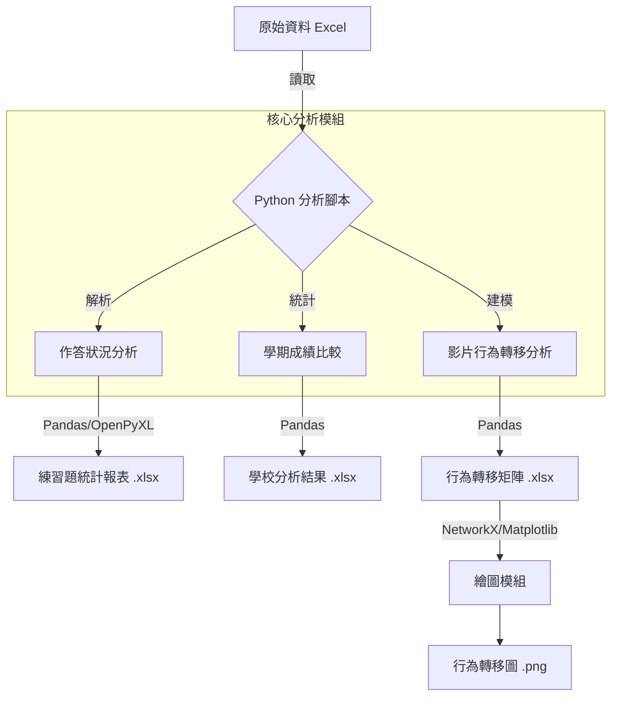
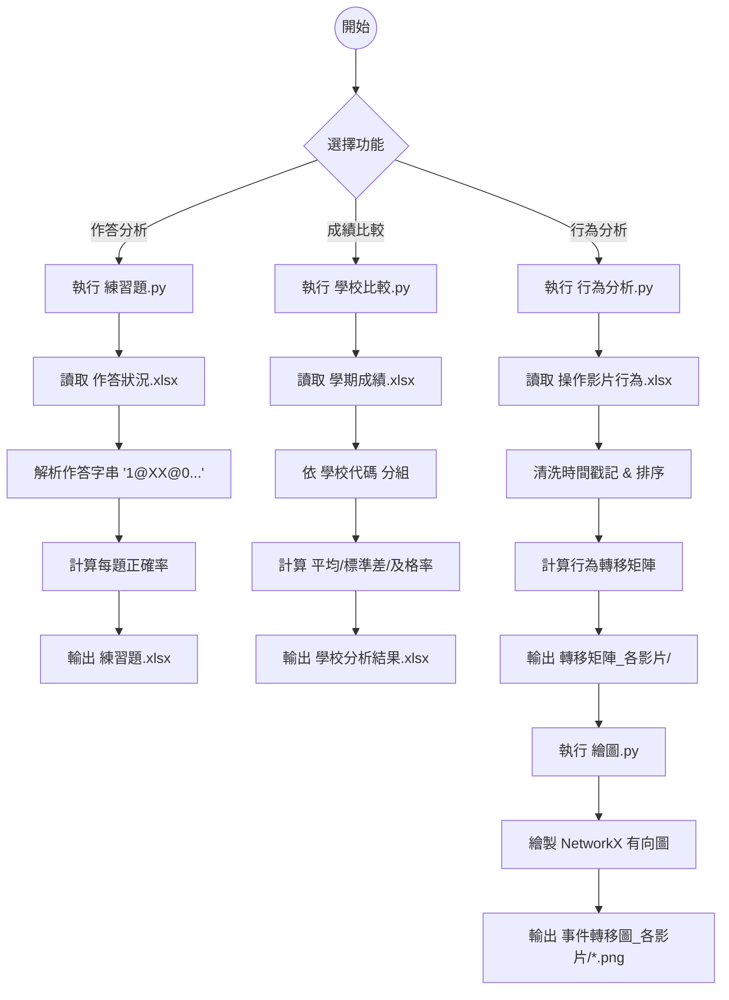
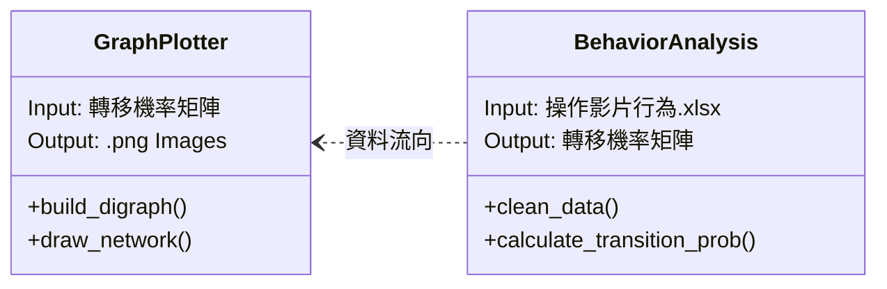

# 教育數據分析專案 (Educational Data Analysis Project)

## 專案總覽 (Project Overview)
本專案為一套針對教育場域數據的分析工具集，主要用於處理學生之學習歷程資料。
- **解決的問題**：自動化處理大量的學生作答紀錄、學期成績數據以及影片學習行為日誌，將原始數據轉化為可視化的統計報表與行為轉移圖。
- **使用對象**：教育研究者、教師或系統管理員。
- **專案性質**：多模組數據分析腳本 (Data Analysis Scripts)。

## 系統架構說明 (Architecture Overview)
本系統由三個獨立但互補的分析模組組成，核心依賴為 Python 數據科學生態系 (Pandas, NetworkX, Matplotlib)。系統讀取 Excel 格式的原始資料，經過清洗與運算後，輸出統計報表與視覺化圖表。

**模組職責：**
1. **作答分析模組**：解析練習題作答字串，計算答對率與填答時間。
2. **成績比較模組**：針對不同學校進行學科成績的統計比較 (平均、標準差、及格率)。
3. **行為分析模組**：利用馬可夫鏈 (Markov Chain) 概念，分析學生在觀看教學影片時的操作行為轉移路徑。

本專案已結案，其中所暴露的Token、API_KEY皆以失效，無需擔心



## 系統流程說明 (System Flow)
以下顯示三個主要功能的執行流程：



## 資料夾結構說明 (Folder Structure)
本專案的主要程式碼位於 `期末成果/本地` 資料夾中。

```text
Web-Programming/
├── 期末成果/
│   └── 本地/              <-- 核心程式碼目錄
│       ├── 1_作答狀況/
│       │   ├── 練習題.py       # 分析練習題作答結果的主程式
│       │   └── 作答狀況.xlsx    # 輸入資料範例
│       ├── 2_學期成績/
│       │   ├── 學校比較.py     # 比較各校成績的主程式
│       │   └── 學期成績.xlsx    # 輸入資料範例
│       └── 3_操作影片行為/
│           ├── 行為分析.py     # 計算行為轉移矩陣的主程式
│           ├── 繪圖.py        # 繪製行為流向圖的輔助程式
│           ├── 操作影片行為.xlsx # 輸入資料範例
│           ├── 轉移機率矩陣_各影片/ # (自動產生) 存放中間產出的 Excel 矩陣
│           └── 事件轉移圖_各影片/   # (自動產生) 存放最終視覺化圖片
└── README.md              # 本專案說明文件
```

## 核心模組與重要檔案 (Key Modules & Files)

| 檔案路徑 | 模組名稱 | 功能職責 | 關聯依賴 |
| :--- | :--- | :--- | :--- |
| `1_作答狀況/練習題.py` | Quiz Analyzer | 解析 `@XX@` 分隔的作答字串，產出各科與各題的答對率報表。 | `pandas`, `openpyxl` |
| `2_學期成績/學校比較.py` | School Comparator | 清洗國英數三科成績，依學校代碼分組計算統計量。 | `pandas`, `openpyxl` |
| `3_操作影片行為/行為分析.py` | Behavior Modeler | 追蹤影片操作序列 (如 Play -> Pause)，計算下一動作的條件機率 (Transition Probability)。 | `pandas` |
| `3_操作影片行為/繪圖.py` | Graph Visualizer | 讀取轉移矩陣，繪製節點 (行為) 與邊 (機率) 的有向圖。 | `networkx`, `matplotlib` |



## 安裝與環境需求 (Installation & Requirements)

### 系統需求
- **OS**: Windows / macOS / Linux
- **Python Version**: Python 3.8+

### 相依套件
請確保安裝以下 Python 套件：
```bash
pip install pandas openpyxl matplotlib networkx
```

### 環境變數
- 本專案主要使用相對路徑讀取同一目錄下的 Excel 檔案，無需設定特殊環境變數。

## 使用方式 (How to Use)

### 1. 分析作答狀況
進入對應資料夾並執行腳本：
```bash
cd "期末成果/本地/1_作答狀況"
python 練習題.py
```
> **結果**：產生 `練習題.xlsx`。

### 2. 分析學期成績
```bash
cd "期末成果/本地/2_學期成績"
python 學校比較.py
```
> **結果**：產生 `學校分析結果.xlsx`。

### 3. 分析影片操作行為
步驟一：產生矩陣
```bash
cd "期末成果/本地/3_操作影片行為"
python 行為分析.py
```
> **結果**：於 `轉移機率矩陣_各影片/` 資料夾中產生多個 Excel 檔。

步驟二：繪製圖表
```bash
python 繪圖.py
```
> **結果**：於 `事件轉移圖_各影片/` 資料夾中產生 PNG 圖片。

## 設定說明 (Configuration)
本專案多數設定採 **Hardcoded** 方式直接寫於程式碼中，若需調整請修改 `.py` 檔：

- **輸入檔名**：預設為 `作答狀況.xlsx`, `學期成績.xlsx` 等，需至各 script 開頭修改 `pd.read_excel()` 的路徑。
- **及格標準**：`學校比較.py` 中預設 `pass_score = 60`。
- **作答分隔符**：`練習題.py` 中預設使用 `@XX@` 作為切割符號。
- **繪圖參數**：`繪圖.py` 中可調整 `figsize` (圖片大小) 或 `k` (Spring Layout 彈力係數)。

## 開發者指南 (Developer Guide)

1. **建議閱讀順序**：
   - 先閱讀 `練習題.py` 理解基礎的 Pandas 資料清洗邏輯。
   - 再閱讀 `行為分析.py` 理解如何處理時間序列數據。
   - 最後研究 `繪圖.py` 學習 NetworkX 的圖形繪製。

2. **修改注意事項**：
   - 修改 Excel 輸出格式時，請保留 `openpyxl` 的欄寬自動調整程式碼，以維持報表可讀性。
   - `繪圖.py` 依賴 `行為分析.py` 的輸出檔名格式與欄位結構，修改前者時需同步測試後者。

## 已知限制與待辦事項 (Limitations & TODO)
- **路徑限制**：程式碼使用相對路徑，必須在該 `.py` 檔案所在目錄下執行指令，否則會找不到 Excel 檔。
- **資料格式依賴**：對 Excel 欄位名稱高度依賴 (如 "影片瀏覽流水號", "執行影片操作的時間戳記")，欄位更名會導致程式錯誤。
- **字型問題**：`Matplotlib` 繪圖時若遇中文標籤，在無適當字型設定的環境下可能會顯示亂碼 (豆腐塊)。

## 補充說明 (Notes)
- `三種分析程式.txt` 紀錄了相關 Web 服務的部署 URL (例如 `analyze-behavior` 等)，可能為本機分析腳本的雲端版本或前端介面。

